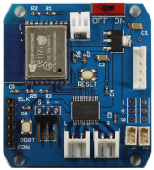
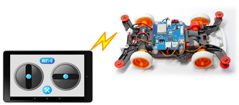

GPduino WiFi
=========

## 概要
GPduino WiFiは、ESP8266搭載のWiFiラジコン制御ボードです。  
<!-- GPduinoに関する詳細は、[GPduino特設ページ](http://lipoyang.net/gpduino)をごらんください。  -->
GPduinoWiFiの回路/基板設計データとプリセットファームウェアのソースをここに公開します。

　　　　　

## ファイル一覧

* firm/GPduinoWiFi/ : ファームウェア(ESP8266のArduinoスケッチ)
* hard/GPduinoWiFi/
	* GPduinoWiFi.sch/brd: 回路/基板設計データ(Eagle形式)
	* GPduinoWiFi.pdf: 回路図(PDF)
	* GPduinoWiFi_BOM.xlsx: BOMリスト(Excel形式)
	* GPduinoWiFi.GBL/GBO/GBP/GBS/GML/GTL/GTO/GTP/GTS/TXT: ガーバデータ
* LICENSE: Apache Licence 2.0です。
	* ただし、回路/基板設計は、Creative Commons Attribution Share-Alike 3.0です。
* README.md これ

## ファームウェアの書き込み
GPduino WiFi はESP8266を搭載しており、Arduinoでファームウェアを開発できます。

* 書き込みには、USBシリアル変換基板が必要です。CN11に接続してください。
	* SparkFun製 FTDI Basic Breakout - 3.3V を推奨します。かならず、3.3Vのものを使用してください。
* まず、ArduinoIDE をインストールしておきます。 (ここでは 1.6.9 を使用)
* [ファイル] > [環境設定] > [Additional Boards Manager URLs:]に下記URLをコピペ
	* http://arduino.esp8266.com/stable/package_esp8266com_index.json (安定版)
	* http://arduino.esp8266.com/staging/package_esp8266com_index.json (開発版)
* [ツール] > [ボード] > [ボードマネージャ] で [esp8266] をインストール
* [ツール] > [ボード] で [Generic ESP8266 Module]を選択
	* Flash Mode : QIO
	* Flash Frequency : 40MHz
	* Upload Using : Serial
	* CPU Frequency : 80MHz
	* Flash Size : 4M(3M SPIFFS)　(3MBをファイルシステムで使用 / 1MBをスケッチで使用)
	* Debug port : Disabled
	* Debug Level : None
	* Reset Method : nodemcu
	* Upload Speed : 115200
	* シリアルポート : USBシリアルのCOM番号
	* 書込装置 : USBasp
* BOOTボタン(SW3)を押し下げた状態で、RESETボタン(SW2)を押して離します。
* Uploadボタンで、ファームウェアを書き込みます。
